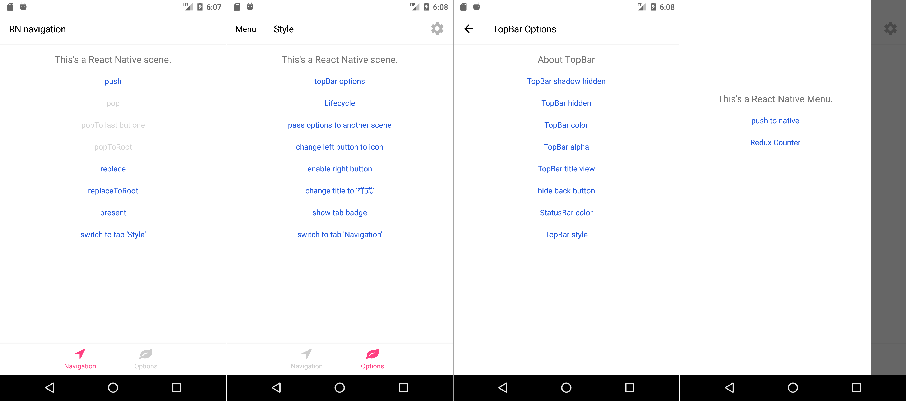
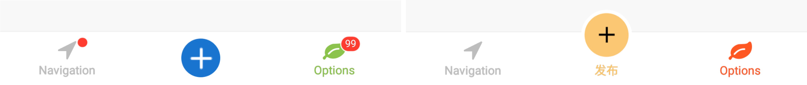

# react-native-navigation-hybrid

Native navigation library for ReactNative, supporting navigating between native and ReactNative seamlessly.



## Running the Playground Project

To run the playground project, first clone this repo:

```shell
git clone git@github.com:listenzz/react-native-navigation-hybrid.git
cd react-native-navigation-hybrid
```

### run on Android

First, make sure that you have a simulator or device.

Then,

```shell
npm install
# &
npm start
```

Then, in another CLI window:

```shell
npm run run:android
```

[**Download demo apk**](https://raw.githubusercontent.com/listenzz/react-native-navigation-hybrid/master/screenshot/app-release.apk)

### run on iOS

First,

```shell
npm install
# &
npm start
```

Then, in another CLI window:

```shell
npm run run:ios
```

## 特性

<a name="migrate-react"></a>

- 使用原生导航组件实现 React Native 页面间的导航，不仅具有更优的性能，而且使得 RN 页面具有原生质感
- 原生页面和 RN 页面共享路由， 使得它们之间相互跳转和传值轻而易举
- 内置 drawer, tabs, stack 标准容器，同时支持自定义容器和导航
- 支持 deep link

## 目录

#### [集成到以 RN 为主的项目](./doc/integration-react.md)

#### [为原生项目添加 RN 模块](./doc/integration-native.md)

#### [容器与导航](./doc/navigation.md)

#### [RN 页面与原生页面相互跳转和传值](./doc/pass-and-return-value.md)

#### [额外的生命周期函数](./doc/lifecycle.md)

#### [设置样式](./doc/style.md)

#### [DeepLink](./doc/deeplink.md)

## 最近更新日志

最新版本: `0.11.14` - 2019/02/25

### 0.11.13 - 2019/02/13

`navigator.isRoot` 重命名为 `navigator.isStackRoot`，以免导致误会。

### 0.11.8 - 2019/01/22

添加选项来决定是否开启 Android 性能优化。

Android 性能优化默认开启，可以通过以下方式全局关闭：

```javascript
Garden.setStyle({
  optimizationEnabledAndroid: false,
});
```

也可以只在特定页面打开或关闭，这会覆盖全局设置

```javascript
class MyComponent extends React.Component {
  static navigationItem = {
    optimizationEnabledAndroid: false,
  };
}
```

### 0.11.5 - 2019/01/12

TabBar 优化，现在即使是突出部分，也能响应事件了



### 0.11.2 - 2019/01/03

Android 性能优化，现在打开上百个 RN 页面也毫无压力。

### 0.11.1 - 2018/12/27

`ReactRegistry.startRegisterComponent` 参数变更，现在接受一个 [HOC](https://reactjs.org/docs/higher-order-components.html) 作为参数。

想要为每个页面都注入相同的属性，可以利用 `ReactRegistry.startRegisterComponent()` 这个方法，它接受一个 [HOC](https://reactjs.org/docs/higher-order-components.html) 作为参数。

想要支持 Redux，像下面这样配置即可

```jsx
function withRedux(WrappedComponent) {
  return props => (
    <Provider store={store}>
      <WrappedComponent {...props} />
    </Provider>
  );
}

ReactRegistry.startRegisterComponent(withRedux);
```

其中 `withRedux` 就是一个 [HOC](https://reactjs.org/docs/higher-order-components.html)

### 0.11.0 - 2018/12/23

- 支持[自定义 TabBar](./doc/custom-tabbar.md)

### 0.10.2 - 2018/12/09

- 导航拦截器现在支持拦截 tab 点击事件啦

```js
Navigator.setInterceptor((action, from, to, extras) => {
  console.info(`action:${action} from:${from} to:${to}`);
  // 当返回 true 时，表示你要拦截该操作
  // 譬如用户想要跳到的页面需要登录，你可以在这里验证用户是否已经登录，否则就重定向到登录页面
  return false;
});
```

注意 `to` 可能为 `undefined` 的情况。譬如通过代码触发的 switchTab，`to` 为 `undefined`。

extras 中有我们需要的额外信息。譬如 sceneId，它表示动作发出的页面， 通过 `Navigator.get(sceneId)` 可以获取对应页面的 navigator，通过该 navigator，你可以执行你想要的导航操作。如果 action 是 switchTab，我们还可以从 extras 中获取 index 这个属性，它表示将要切换到的 tab 的位置，从 0 开始。

### 0.10.0 - 2018/11/21

- 现在支持 typescript 啦

### 0.9.1 - 2018/10/14

navigationItem 添加 `navigationBarColorAndroid` 可配置项，用于修改虚拟键的背景颜色，对 Andriod 8.0 以上版本生效。默认规则如下：

- 含「底部 Tab」的页面，虚拟键设置为「底部 Tab」的颜色

- 不含「底部 Tab」的页面，默认使用页面背景颜色，也就是 `screenBackgroundColor`

- modal 默认是透明色

某些页面，比如从底部往上滑的 modal, 需要开发者使用 `navigationBarColorAndroid` 自行适配，请参考 playground/src/ReactModal.js 这个文件

### 0.9.0 - 2018/10/7

- react-native 升级到 0.57.1，不再兼容低于 0.57.1 的版本，请参考官方文档进行 react-native 的升级

- 为了支持凹凸屏、刘海屏，Android 构建版本更新到 28，请查看 [集成到以 RN 为主的项目](./doc/integration-react.md) 和 [为原生项目添加 RN 模块](./doc/integration-native.md) 以及 [同步构建版本](./doc/sync-build-version.md) 以获得最新的指引。

- 布局描述对象改变，也就是 `Navigator#setRoot` 接受的第一个参数格式发生变化，现在如何正确地传递布局对象，请查看 [容器与导航](./doc/navigation.md)

- `routeGraph` 从 `router` 移动到 `Navigator`, 返回的数据结构也发生了变化，以更好地描述 UI 层级，详情请查看 [容器与导航](./doc/navigation.md)

- `currentRoute` 从 `router` 移动到 `Navigator`

- 移除了所有已经弃用的 API
