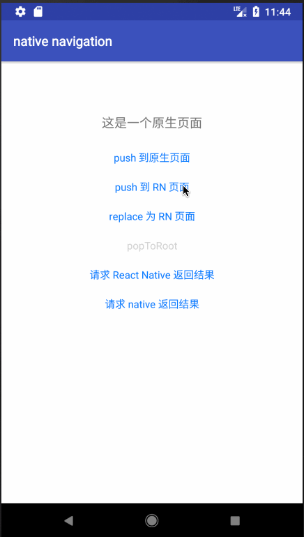

# react-native-navigation-hybrid
A native navigation for React Native which support navigation between native and react side

## Running the Example Project



To run the example project, first clone this repo:

```shell
git clone git@github.com:listenzz/react-native-navigation-hybrid.git
cd react-native-navigation-hybrid
```

```shell
npm install
```

```shell
npm start
```

Then, in another CLI window:

To run on iOS: npm run run:ios

To run on Android: npm run run:android

make sure that you have a  simulator or device when you run andriod