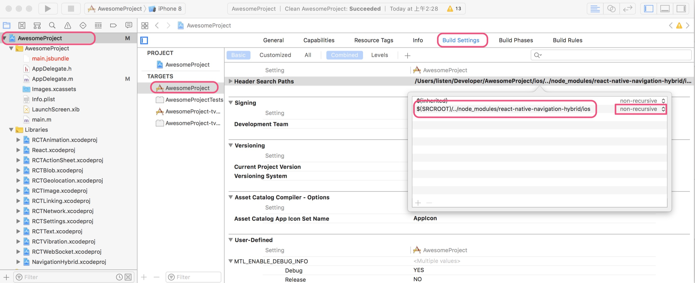
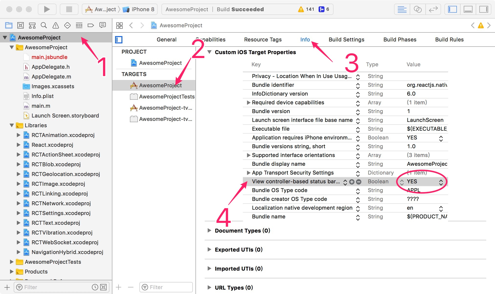
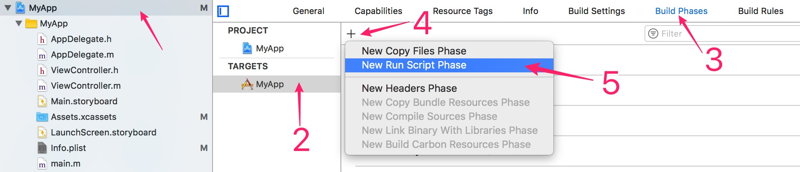
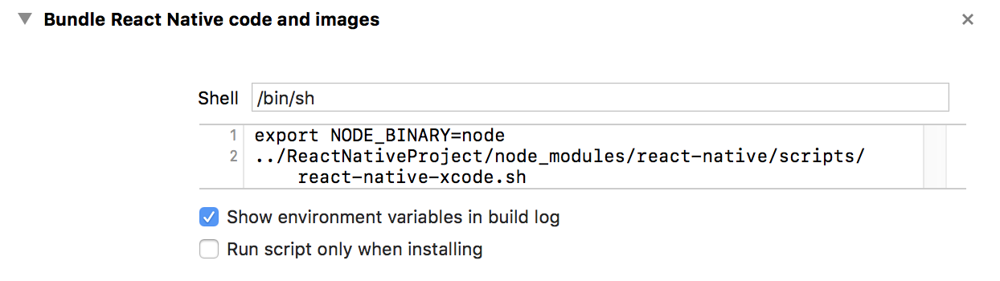
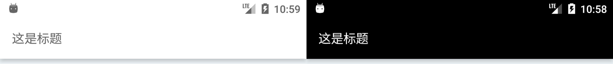
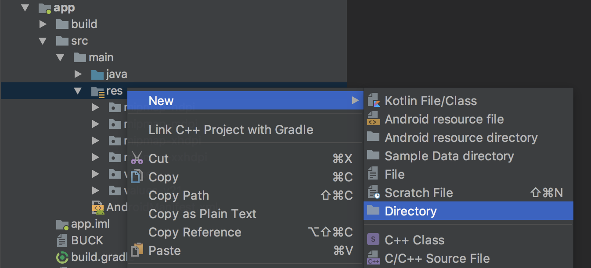
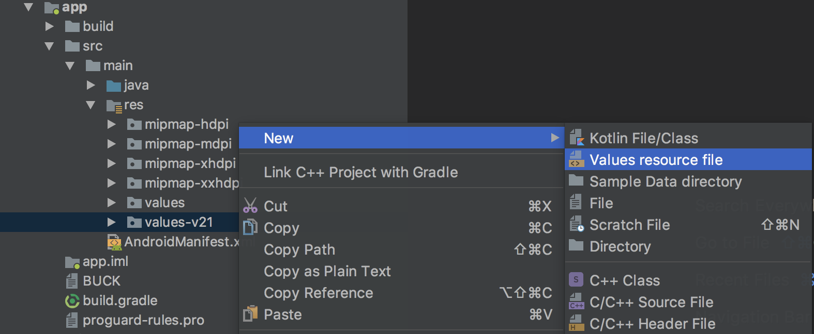

# react-native-navigation-hybrid
A native navigation for React Native.


## Running the Playground Project

To run the playground project, first clone this repo:

```shell
git clone git@github.com:listenzz/react-native-navigation-hybrid.git
cd react-native-navigation-hybrid
```

```shell
npm install
```

```shell
npm start
```

Then, in another CLI window:

To run on iOS: `npm run run:ios`

To run on Android: `npm run run:android`

make sure that you have a  simulator or device when you run andriod

## 特性

<a name="migrate-react"></a>

- 使得 React Native 应用更具原生质感
- 支持 Stack、Tabs、Drawer 等容器
- 以 iOS 的导航系统为参照，支持 push, pop, popTo, popToRoot, present, dismiss 等操作
- 支持 StatusBar, UINavigationBar(iOS), UITabBar(iOS), Toolbar(Android), BottomNavigationBar(Android) 的全局样式配置以及局部调整
- 支持原生页面和 RN 页面互相跳转和传值

## 目录

#### [集成到以 RN 为主的项目](#migrate-react)

#### [为原生项目添加 RN 模块](#migrate-native)

#### [容器](#container)

#### [RN 页面与原生页面相互跳转和传值](#navigation-hybrid)

#### [设置样式](#style)


## 集成到以 RN 为主的项目

你想用 React Native 实现大部分业务，原生代码主要起到搭桥的作用。

可以参考 [iReading Fork](https://github.com/listenzz/reading) 这个项目。

假设你是通过 `react-native init AwesomeProject` 创建的项目，目录结构是这样的：

```
AwesomeProject/
|—— android/
|—— ios/
|—— node_modules/
|—— package.json
```

### 添加依赖

```
npm install react-native-navigation-hybrid --save
```

### Link

```
$ react-native link react-native-navigation-hybrid
```

### RN 项目配置

打开 index.js 这个文件，通常，它就在 package.json 旁边。

以前，你是这么注册 React 组件

```javascript
AppRegistry.registerComponent('ReactNativeProject', () => App);
```

现在，你需要像下面那样

```javascript
import { ReactRegistry, Garden, Navigation } from 'react-native-navigation-hybrid';
import Home from './HomeComponent';
import Profile from './ProfileComponent';

// 配置全局样式
Garden.setStyle({
    topBarStyle: 'dark-content',
});

// 重要必须
ReactRegistry.startRegisterComponent();

// 注意，你的每一个页面都需要注册
ReactRegistry.registerComponent('Home', () => Home);
ReactRegistry.registerComponent('Profile', () => Profile);

// 重要必须
ReactRegistry.endRegisterComponent();
```

设置入口页面布局

```javascript
Navigation.setRoot({
  drawer: [
    {
      tabs: [
        {
          stack: {
            screen: { moduleName: 'Navigation' },
          },
        },
        {
          stack: {
            screen: { moduleName: 'Options' },
          },
        },
      ],
    },
    {
      screen: { moduleName: 'Menu' },
      options: {
        maxDrawerWidth: 280,
        minDrawerMargin: 64,
      },
    },
  ],
});
```

根布局一共有四种类型的布局: screen, stack, tabs 以及 drawer

screen 对象有三个属性，分别是 moduleName, props, options，其中 moduleName 是必须的，它就是我们上面注册的那些模块名，props 是我们要传递给该页面的初始属性，options 是 navigationItem，参看[静态配置页面](#static-options)。

stack 对象包含一个其它布局对象作为根页面，通常是 screen.

tabs 对象是一个数组，成员是一个包含其它布局对象的对象

drawer 对象也是一个数组，长度固定为 2 ，第一个对象是抽屉的内容，第二个对象是抽屉的侧边栏。

可以在表示侧边栏的对象中添加 options 属性来配置侧边栏的宽度

`maxDrawerWidth` 表示侧边栏的最大宽度，`minDrawerMargin` 表示侧边栏距屏幕边缘的最小空隙，这两个属性可以单独使用，也可以一起指定。

可以先通过 `Navigation.setRoot` 设置一个入口页面，然后根据应用状态再次调用 `Navigation.setRoot` 决定要进入哪个页面。

#### 支持 Redux

想要为每个页面都注入相同的属性，可以利用 `ReactRegistry.startRegisterComponent()` 这个方法，它接受一个函数作为参数，该函数的参数是一个返回我们将要构建的组件的函数，返回值是一个新的组件。

想要支持 Redux，像下面这样配置即可

```javascript
function componentWrapper(componentProvider) {
    const InnerComponent = componentProvider();
    class WrapperComponent extends Component {
        render() {
            return(
                <Provider store={store}>
                    <InnerComponent {...this.props}/>
                </Provider>
            );
        }
    }
    return WrapperComponent;
}

ReactRegistry.startRegisterComponent(componentWrapper)

```

不要忘了 `...this.props`, 很重要。

### Android 项目配置

假设你已经配置好了 React 项目

修改 android/build.gradle 文件

```diff
buildscript {
    repositories {
        jcenter()
+       google()
    }
    dependencies {
-        classpath 'com.android.tools.build:gradle:2.2.3'
+        classpath 'com.android.tools.build:gradle:3.1.0'
    }
}

allprojects {
    repositories {
        mavenLocal()
        jcenter()
        maven {
            // All of React Native (JS, Obj-C sources, Android binaries) is installed from npm
            url "$rootDir/../node_modules/react-native/android"
        }
+       google()
    }
}

+ ext {
+   minSdkVersion = 16
+   targetSdkVersion = 27
+   compileSdkVersion = 27
+   buildToolsVersion = '27.0.3'
+   // 必须保证支持包的版本 >= 26.1.0
+   supportLibraryVersion = '27.1.0'
+ }

```

修改 android/app/build.gradle 文件

```diff

android {
-   compileSdkVersion 23
-   buildToolsVersion "23.0.1"
+   compileSdkVersion rootProject.ext.compileSdkVersion
+   buildToolsVersion rootProject.ext.buildToolsVersion

    defaultConfig {
-       minSdkVersion 16
-       targetSdkVersion 22
+       minSdkVersion rootProject.ext.minSdkVersion
+       targetSdkVersion rootProject.ext.targetSdkVersion
    }
}

dependencies {  
+    compile project(':react-native-navigation-hybrid')
     compile fileTree(dir: "libs", include: ["*.jar"])
-    compile "com.android.support:appcompat-v7:23.0.1"
+    compile "com.android.support:appcompat-v7:$rootProject.supportLibraryVersion"
     compile "com.facebook.react:react-native:+" // From node_modules
     
+    configurations.all {
+    resolutionStrategy.eachDependency { DependencyResolveDetails details ->
+        def requested = details.requested
+            if (requested.group == 'com.android.support') {
+                if (!requested.name.startsWith("multidex")) {
+                    details.useVersion rootProject.supportLibraryVersion
+                }
+            }
+        }
+    }

}
```

修改 android/gradle/wrapper/gradle-wrapper.properties 文件

```diff
- distributionUrl=https\://services.gradle.org/distributions/gradle-2.14.1-all.zip
+ distributionUrl=https\://services.gradle.org/distributions/gradle-4.4-all.zip
```

修改 MainActivity.java 文件

```diff
- import com.facebook.react.ReactActivity;
+ import com.navigationhybrid.ReactAppCompatActivity;

- public class MainActivity extends ReactActivity {
+ public class MainActivity extends ReactAppCompatActivity {
 
-    @Override
-    protected String getMainComponentName() {
-        return "AwesomeProject";
-    }
 }

```

修改 MainApplication.java 文件

```diff

+ import com.navigationhybrid.ReactBridgeManager;

 public void onCreate() {
     super.onCreate();
     SoLoader.init(this, /* native exopackage */ false);

+    ReactBridgeManager bridgeManager = ReactBridgeManager.instance;
+    bridgeManager.install(getReactNativeHost());
    
 }

```

同步构建版本，参看[这里](#sync-build-version)

### iOS 项目配置

修改 Header Search Paths



修改 AppDelegate.m 文件

```objc

#import "AppDelegate.h"

#import <React/RCTBundleURLProvider.h>
#import <NavigationHybrid/NavigationHybrid.h>

@implementation AppDelegate

- (BOOL)application:(UIApplication *)application didFinishLaunchingWithOptions:(NSDictionary *)launchOptions
{
  NSURL *jsCodeLocation;

  jsCodeLocation = [[RCTBundleURLProvider sharedSettings] jsBundleURLForBundleRoot:@"index" fallbackResource:nil];
  [[HBDReactBridgeManager sharedInstance] installWithBundleURL:jsCodeLocation launchOptions:launchOptions];

  self.window = [[UIWindow alloc] initWithFrame:[UIScreen mainScreen].bounds];
  UIViewController *rootViewController = [UIViewController new];
  self.window.rootViewController = rootViewController;
  [self.window makeKeyAndVisible];
  return YES;
}

@end
```

修改 Info.plist 文件



### 关于闪屏

<a name="migrate-native"></a>

可以像 playgroud 这个 demo 那样设置闪屏，也可以使用 react-native-splash-screen 设置闪屏

## 为原生项目添加 RN 模块

你的大部分业务已经用原生代码实现，你想添加一些 RN 业务模块。

添加 RN 业务模块的原生项目，和通过 `react-native init` 命令创建的项目，它们的目录结构往往是不同的。

通过 `react-native init ReactNativeProject` 创建的项目，目录结构是这样的：

```
ReactNativeProject/
|—— android/
|—— ios/
|—— node_modules/
|—— package.json
```

添加 RN 业务模块的原生项目，目录结构可能是这样的：

```
AndroidProject/
|—— settings.gradle
|—— ReactNativeProject/
|   |—— node_modules/
|   |—— package.json

iOSProject/
|—— Podfile
|—— ReactNativeProject/
|   |—— node_modules/
|   |—— package.json
```

以上，Android 和 iOS 项目使用 git submodule 的方式依赖同一个 RN 项目。

也可能是这样的：

```
AndroidProject/
|—— settings.gradle
iOSProject/
|—— Podfile
ReactNativeProject/
|—— node_modules/
|—— package.json
```

以上，Android 和 iOS 项目使用 gradle 或者 cocopods 依赖本地 RN 项目。

第二和第三种目录结构，在集成上没多大区别。 这里，我们以后者的目录结构来演示如何集成 react-native-navigaton-hybrid 到原生项目。

### 创建 RN 项目并集成 Navigation Hybrid

在和原生应用同级的目录下，使用 `react-native init ReactNativeProject` 命令创建 RN 业务模块。

创建成功后，打开该目录，删除里面的 andriod 和 ios 文件夹，因为我们不会用到它们。

cd 到 ReactNativeProject，执行如下命令添加依赖

```
npm install react-native-navigation-hybrid --save
```

### RN 项目配置

打开 index.js 这个文件，通常，它就在 package.json 旁边。

你需要注册你的 React 组件

以前，你是这么注册的

```javascript
AppRegistry.registerComponent('ReactNativeProject', () => App);
```

现在，你需要作出改变

```javascript
import { ReactRegistry, Garden } from 'react-native-navigation-hybrid';
import Home from './HomeComponent';
import Profile from './ProfileComponent';

// 配置全局样式
Garden.setStyle({
    topBarStyle: 'dark-content',
});

ReactRegistry.startRegisterComponent();

// 注意，你的每一个页面都需要注册
ReactRegistry.registerComponent('Home', () => Home);
ReactRegistry.registerComponent('Profile', () => Profile);

ReactRegistry.endRegisterComponent();
```

### Android 项目配置

现在，我们回到 Android 项目，在 settings.gradle 中添加如下配置

```gradle
include ':react-native-navigation-hybrid'
// 注意把 ReactNativeProject 替换成你的 RN 项目
project(':react-native-navigation-hybrid').projectDir = new File(rootProject.projectDir, '../ReactNativeProject/node_modules/react-native-navigation-hybrid/android')
```

在根项目的 build.gradle 文件中，确保以下配置或变更

```diff
ext {
+   minSdkVersion = 16
+   targetSdkVersion = 27
+   compileSdkVersion = 27
+   buildToolsVersion = '27.0.3'
+   // 必须保证支持包的版本 >= 26.1.0
+   supportLibraryVersion = '27.1.0'
+   // 注意把 ReactNativeProject 替换成你的 RN 项目
+   rn_root = "$rootDir/../ReactNativeProject"
}

buildscript {
    repositories {
        jcenter()
+       google()
    }
    dependencies {
-        classpath 'com.android.tools.build:gradle:2.2.3'
+        classpath 'com.android.tools.build:gradle:3.1.0'
    }
}

allprojects {
    repositories {
        mavenLocal()
        jcenter()
+       google()
+       maven { url "${rn_root}/node_modules/react-native/android" }
    }
}
```

然后，在 app/build.gradle 文件中，作如下变更

```diff
+ project.ext.react = [
+       entryFile                : "index.js",
+       root                     : "$rn_root"
+ ]

+ apply from: "$rn_root/node_modules/react-native/react.gradle"

android {
+   compileSdkVersion rootProject.ext.compileSdkVersion
+   buildToolsVersion rootProject.ext.buildToolsVersion

    defaultConfig {
+       minSdkVersion rootProject.ext.minSdkVersion
+       targetSdkVersion rootProject.ext.targetSdkVersion
    }
}

dependencies {
+   implementation fileTree(include: ['*.jar'], dir: 'libs')
   
+   implementation "com.android.support:appcompat-v7:$rootProject.supportLibraryVersion"
+   implementation "com.android.support:support-v4:$rootProject.supportLibraryVersion"
+   implementation "com.android.support:design:$rootProject.supportLibraryVersion"
   
+   implementation project(':react-native-navigation-hybrid')
+   implementation "com.facebook.react:react-native:+" // From node_modules
}
```

在根项目下的 gradle/wrapper/gradle-wrapper.properties 文件中，确保你使用了正确的 gradle wrapper 版本。

```diff
- distributionUrl=https\://services.gradle.org/distributions/gradle-2.14.1-all.zip
+ distributionUrl=https\://services.gradle.org/distributions/gradle-4.4-all.zip
```

修改 MainApplication.java 文件。在你的项目中，可能叫其它名字。

```java
public class MainApplication extends Application implements ReactApplication {
    private final ReactNativeHost mReactNativeHost = new ReactNativeHost(this) {
        @Override
        public boolean getUseDeveloperSupport() {
            return BuildConfig.DEBUG;
        }
        
        @Override
        protected List<ReactPackage> getPackages() {
            return Arrays.<ReactPackage>asList(
                new MainReactPackage(),
                new NavigationHybridPackage()
            );
        }
        
        @Override
        protected String getJSMainModuleName() {
            return "index";
        }
    };
    
    @Override
    public ReactNativeHost getReactNativeHost() {
        return mReactNativeHost;
    }
    
    public void onCreate() {
        super.onCreate();
        // react native
        SoLoader.init(this, /* native exopackage */ false);
        ReactBridgeManager bridgeManager = ReactBridgeManager.instance;
        bridgeManager.install(getReactNativeHost());
    }
}
```

创建一个 Activity 继承 ReactAppCompatActivity

重写 `getMainComponentName` 方法

```java
public class ReactEntryActivity extends ReactAppCompatActivity {
    @Override
    protected String getMainComponentName() {
        return "Home";
    }
}
```

或者 `onCreateMainComponent` 方法

```java
@Override
protected void onCreateMainComponent() {
    AwesomeFragment react = getReactBridgeManager().createFragment("ReactNavigation");
    ReactNavigationFragment reactNavigation = new ReactNavigationFragment();
    reactNavigation.setRootFragment(react);

    AwesomeFragment custom = getReactBridgeManager().createFragment("CustomStyle");
    ReactNavigationFragment customNavigation = new ReactNavigationFragment();
    customNavigation.setRootFragment(custom);

    ReactTabBarFragment reactTabBarFragment = new ReactTabBarFragment();
    reactTabBarFragment.setFragments(reactNavigation, customNavigation);

    setRootFragment(reactTabBarFragment);
}
```

第一种写法相当于

```java
@Override
protected void onCreateMainComponent() {
    AwesomeFragment home = getReactBridgeManager().createFragment("Home");
    ReactNavigationFragment navigation = new ReactNavigationFragment();
    navigation.setRootFragment(home);
    
    setRootFragment(navigation);
}
```

为该 Activity 添加 NoActionBar 主题

```xml
<activity
    android:name=".ReactEntryActivity"
    android:theme="@style/Theme.AppCompat.NoActionBar"
/>
```

<a name="sync-build-version"></a>

在 AndroidManifest.xml 中添加如下权限

```xml
<uses-permission android:name="android.permission.INTERNET" />
<uses-permission android:name="android.permission.SYSTEM_ALERT_WINDOW"/>
```

#### 同步构建版本

Navigation Hybrid 使用的构建版本是 27.1.0 ，你的项目可能使用了更高或稍低的版本。你也可能使用了 [react-native-vector-icons](https://github.com/oblador/react-native-vector-icons) 这样的库，它的构建版本是 26.0.1 ，我们需要用脚本把这些库的构建版本统一起来，否则编译项目时可能会出错。

回到 RN 项目的根目录，创建一个叫 scripts 的文件夹，在里面创建一个叫 fix-build-version.js 的文件

```javascript
const fs = require('fs-extra')

// 找到 NavigatonHybrid 的 build.gradle 文件
const navigationHybrid = './node_modules/react-native-navigation-hybrid/android/build.gradle'

// 其它使用了原生源码的库，例如：
// const codePush = './node_modules/react-native-code-push/android/app/build.gradle'
// const vectorIcons = './node_modules/react-native-vector-icons/android/build.gradle'

const gradles = [
  navigationHybrid,
  // codePush,
  // vectorIcons,
]

gradles.forEach(gradle => {
  fs.readFile(gradle, 'utf8', function(err, data) {
    let str = data.replace(/^(\s+compileSdkVersion).*$/gm, '$1 rootProject.ext.compileSdkVersion')
    str = str.replace(/^(\s+buildToolsVersion).*$/gm, '$1 rootProject.ext.buildToolsVersion')
    str = str.replace(/^(\s+targetSdkVersion).*$/gm, '$1 rootProject.ext.targetSdkVersion')
    str = str.replace(/["'](com\.android\.support:appcompat-v7:).*["']/gm, '"$1$rootProject.ext.supportLibraryVersion"')
    str = str.replace(/["'](com\.android\.support:support-v4:).*["']/gm, '"$1$rootProject.ext.supportLibraryVersion"')
    str = str.replace(/["'](com\.android\.support:design:).*["']/gm, '"$1$rootProject.ext.supportLibraryVersion"')
    fs.outputFile(gradle, str)
  })
})

```

现在，让我们激活这个脚本。打开 package.json 文件，作如下修改

```diff
"scripts": {
    "start": "react-native start",
+   "fbv": "node scripts/fix-build-version.js",
+   "postinstall": "npm run fbv"
}
```

执行一次 `npm install` 或 `yarn install`

### iOS 项目配置

假设你使用 cocopods 来管理依赖

在 Podfile 文件中添加如下设置

```ruby
# 注意把 ReactNativeProject 替换成你的项目
node_modules_path = '../ReactNativeProject/node_modules/'
  
pod 'React', :path => node_modules_path + 'react-native', :subspecs => [
    'Core',
    'CxxBridge',
    'DevSupport', # Include this to enable In-App Devmenu if RN >= 0.43
    'RCTAnimation',
    'RCTActionSheet',
    'RCTText',
    'RCTImage',
    'RCTSettings',
    'RCTCameraRoll',
    'RCTVibration',
    'RCTNetwork',
    'RCTLinkingIOS',
    'RCTWebSocket', # needed for debugging
]

# Explicitly include Yoga if you are using RN >= 0.42.0
pod 'yoga', :path => node_modules_path +  'react-native/ReactCommon/yoga'
pod 'DoubleConversion', :podspec => node_modules_path + 'react-native/third-party-podspecs/DoubleConversion.podspec'
pod 'GLog', :podspec => node_modules_path + 'react-native/third-party-podspecs/GLog.podspec'
pod 'Folly', :podspec => node_modules_path + 'react-native/third-party-podspecs/Folly.podspec'
  
pod 'NavigationHybrid', :path => node_modules_path + 'react-native-navigation-hybrid'
```

记得 `pod install` 一次。

找到 Info.plist 文件，右键 -> Open As -> Source Code，添加如下内容

```xml
<key>NSAppTransportSecurity</key>
<dict>
    <key>NSExceptionDomains</key>
    <dict>
        <key>localhost</key>
        <dict>
            <key>NSExceptionAllowsInsecureHTTPLoads</key>
            <true/>
        </dict>
    </dict>
</dict>
```

在 Build Phases 中新建一个 Run Script



双击标题，将其更名为 Bundle React Native code and images

点击三角图标展开，在其中填入

```
export NODE_BINARY=node
../ReactNativeProject/node_modules/react-native/scripts/react-native-xcode.sh
```

注意将 ReactNativeProject 替换成你的 RN 项目名



像下面那样更改 AppDelegate.m 文件

<a name="container"></a>

```objc
#import <NavigationHybrid/NavigationHybrid.h>
#import <React/RCTBundleURLProvider.h>

@implementation AppDelegate

- (BOOL)application:(UIApplication *)application didFinishLaunchingWithOptions:(NSDictionary *)launchOptions {
    // Override point for customization after application launch.
    NSURL *jsCodeLocation;
    jsCodeLocation = [[RCTBundleURLProvider sharedSettings] jsBundleURLForBundleRoot:@"index" fallbackResource:nil];
    [[HBDReactBridgeManager sharedInstance] installWithBundleURL:jsCodeLocation launchOptions:launchOptions];

    UIViewController *rootViewController = [UIViewController new];
    self.window.rootViewController = rootViewController;
    [self.window makeKeyAndVisible];
    return YES;
}
@end

```

## 容器

### Stack 

- 导航栈

	我们先要理解一个叫**导航栈**的概念。在 iOS 中，一个导航栈对应一个 `UINavigationController`；在 Android 中，一个导航栈对应一个 `FragmentManager`。

- push

	由 A 页面跳转到 B 页面。
	
	```javascript
    // A.js
    this.props.navigation.push('B')
	```

- pop

	返回到前一个页面。比如你由 A 页面 `push` 到 B 页面，现在想返回到 A 页面。
	
	```javascript
    // B.js
    this.props.navigation.pop()
	```

- popTo

	返回到之前的指定页面。比如你由 A 页面 `push` 到 B 页面，由 B 页面 `push` 到 C 页面，由 C 页面 `push` 到 D 页面，现在想返回 B 页面。你可以把 B 页面的 `sceneId` 一直传递到 D 页面，然后调用 `popTo('bId')` 返回到 B 页面。
	
	从 B 页面跳转到 C 页面时
	
	```javascript
    // B.js
    this.props.navigation.push('C', {bId: this.props.sceneId})
	```
	
	从 C 页面跳到 D 页面时 
	
	```javascript
    // C.js
    this.props.navigation.push('D', {bId: this.props.bId})
	```
	
	现在想从 D 页面 返回到 B 页面
	
	```javascript
    // D.js
    this.props.navigation.popTo(this.props.bId)
	```
	
- popToRoot

	返回到当前导航栈根页面。比如 A 页面是根页面，你由 A 页面 `push` 到 B 页面，由 B 页面 `push` 到 C 页面，由 C 页面 `push` 到 D 页面，现在想返回到根部，也就是 A 页面。
	
	```javascript
    // D.js
    this.props.navigation.popToRoot()
	```

- isRoot

	判断一个页面是否根页面，返回值是一个 Promise.
	
	```javascript
    componentWillMount() {
        this.props.navigation.isRoot().then((isRoot) => {
            if(isRoot) {
                this.props.garden.setLeftBarButtonItem({title: '取消', action: 'cancel'});
                this.setState({isRoot});
            }
        })
    }
	``` 

- replace

	用指定页面取代当前页面，比如当前页面是 A，想要替换成 B
	
	```javascript
    // A.js
    this.props.navigation.replace('B')
	```
	
	现在导航栈里没有 A 页面了，被替换成了 B。
	
	> 注意：只能替换位于当前导航栈顶端的页面
	
- replaceToRoot

	把当前导航栈里的所有页面替换成一个页面。譬如 A 页面是根页面，然后 `push` 到 B、C、D 页面，此时导航栈里有 A、B、C、D 四个页面。如果想要重置当前导航栈，把 E 页面设置成根页面。
	
	```javascript
    // D.js
    this.props.navigation.replaceToRoot('E')
	```
	
	现在导航栈里只有 E 页面了。

- present

	present 是一种模态交互模式，类似于 Android 的 `startActivityForResult`，要求后面的页面返回结果给发起 present 的页面。
	
	比如 A 页面 `present` 出 B 页面
	
	```javascript
    // A.js
    this.navigation.present('B', 1)
	```
	
	B 页面返回结果给 A 页面 
	
	```javascript
    // B.js
    this.navigation.setResult(RESULT_OK, {text: 'greeting'})
    this.navigation.dismiss()
	```
	
	A 页面通过实现 `onComponentResult` 方法来接收结果
	
	```javascript
    // A.js
    onComponentResult(requestCode, resultCode, data) {
        if(requestCode === 1) { 
            if(resultCode === RESULT_OK) {
                this.setState({text: data.text || '', error: undefined});
            } else {
                this.setState({text: undefined, error: 'ACTION CANCEL'});
            }
        }
    }
	```
	
	有些时候，比如选择一张照片，我们先要跳到相册列表页面，然后进入某个相册选择相片返回。这也是没有问题的。
	
	A 页面 `present` 出相册列表页面
	
	```javascript
    //A.js
    this.props.navigation.present('AlbumList', 1)
	```
	
	相册列表页面 `push` 到某个相册
	
	```javascript
    // AlbumList.js
    this.props.navigation.push('Album')
	```
	
	在相册页面选好相片后返回结果给 A 页面
	
	```javascript
    // Album.js
    this.props.navigation.setResult(RESULT_OK, {uri: 'file://...'})
    this.props.navigation.dismiss()
	```
	
	在 A 页面接收返回的结果（略）。
	
	> pop, popTo, popToRoot 也是可以返回结果给目标页面的，但是此时 `requestCode` 的值总是 0 。
	
- dismiss

	关闭 `present` 出来的整个导航栈中的页面，可以在当前导航栈中的任意页面调用。
	
- 传值

	由一个页面跳转到另一个页面时，`push`, `present`, `replace`, `replaceToRoot` 是可以通过 props 这个参数来传值的，但只支持可以序列化成 json 的对象。以下是这些方法的完整签名：
	
	```javascript
    push(moduleName, props={}, options={}, animated = true)
    	
    replace(moduleName, props={}, options={})
    	
    replaceToRoot(moduleName, props={}, options={})
    	
    present(moduleName, requestCode,  props={}, options={}, animated = true)
	```
	
	options 这个参数的作用我们会在其它地方讲解。
	
- 导航栈边界

	比如 A `push` B `push` C `push` D `present` E `push` F
	
	现在存在两个导航栈，A、B、C、D 在一个栈，E 和 F 在另一栈，它们分界就是因为 E 是 D `present` 出来的。
	
	`popTo`, `popToRoot`, `replaceToRoot`, `isRoot` 都是有边界的
	
	在 F 调用 `popTo` 是不能返回 A、B、C、D 中的任何页面的，因为 F 和它们不在同一个栈。
	
	在 F 调用 `popToRoot` 只能返回到 E 页面，因为 E 就是 F 所在栈的根部。
	
	同理，在 F 调用 `replaceToRoot` 只能替换到 E 页面。
	
	在 A 或 E 中调用 `isRoot` 会返回 `true`，其它页面返回 `false`
	

### Tab

- switchToTab
    
    切换到指定 tab
    
- setTabBadge

    设置指定 tab 的 badge

### Drawer

- toggleMenu

    切换抽屉的开关状态

<a name="navigation-hybrid"></a>
    
- openMenu

    打开抽屉
    
- closeMenu

    关闭抽屉
    
- setMenuInteractive

    是否允许通过手势打开 Menu

    ```javascript
    componentDidAppear() {
        this.props.navigation.setMenuInteractive(true);
    }
    
    componentDidDisappear() {
        this.props.navigation.setMenuInteractive(false);
    }
    ```


## RN 页面与原生页面相互跳转和传值

我们为原生和 RN 页面提供了一致的转场和传值方式。

RN 页面如何跳转和传值，我们 [容器](#container) 一章已经提及，你不需要理会目标页面是原生的还是 RN 的，只要当前页面是 RN 的，处理方式都一样。

下面我们来说原生页面的跳转和传值方式：

### 创建原生页面

Android 需要继承 `HybridFragment`，具体可以参考 playground 项目中 `OneNativeFragment` 这个类：

```java
// android
public class OneNativeFragment extends HybridFragment {

}
```

HybridFragment 继承于 `AwesomeFragment`，关于 AwesomeFragment 更多细节，请看 [AndroidNavigation](https://github.com/listenzz/AndroidNavigation) 这个子项目。

iOS 需要继承 `HBDViewController`，具体可以参考 playground 项目中 `OneNativeViewController` 这个类：

```objc
// ios
#import <NavigationHybrid/NavigationHybrid.h>

@interface OneNativeViewController : HBDViewController

@end
```

### 注册原生页面

Android 注册方式如下

```java
public class MainApplication extends Application implements ReactApplication{

    @Override
    public void onCreate() {
        super.onCreate();
        SoLoader.init(this, false);

        ReactBridgeManager bridgeManager = ReactBridgeManager.instance;
        bridgeManager.install(getReactNativeHost());

        // 注册原生模块
        bridgeManager.registerNativeModule("OneNative", OneNativeFragment.class);
    }
}

```

iOS 注册方式如下

```objc
@implementation AppDelegate

- (BOOL)application:(UIApplication *)application didFinishLaunchingWithOptions:(NSDictionary *)launchOptions {
    
    NSURL *jsCodeLocation = [[RCTBundleURLProvider sharedSettings] jsBundleURLForBundleRoot:@"playground/index" fallbackResource:nil];
    [[HBDReactBridgeManager sharedInstance] installWithBundleURL:jsCodeLocation launchOptions:launchOptions];
    
    // 注册原生模块
    [[HBDReactBridgeManager sharedInstance] registerNativeModule:@"OneNative" forController:[OneNativeViewController class]];
    
    return YES;
}

@end
```

> 如果 RN 和原生都注册了同样的模块，即模块名相同，会优先采用 RN 模块。一个应用场景是，如果线上原生模块有严重 BUG，可以通过热更新用 RN 模块临时替换，并指引用户升级版本。


### 原生页面的跳转

首先实例化目标页面

```java
// android
AwesomeFragment fragment = getReactBridgeManager().createFragment("moduleName");
```

```objc
// ios
HBDViewController *vc = [[HBDReactBridgeManager sharedInstance] controllerWithModuleName:@"moduleName" props:nil options:nil];
```

就这样实例化目标页面，不管这个页面是 RN 的还是原生的。

接下来使用原生方式跳转

```java
// android
NavigationFragment navigationFragment = getNavigationFragment();
if (navigationFragment != null) {
    navigationFragment.pushFragment(fragment);
}
```

关于 NavigationFragment 的更多细节，请看 [AndroidNavigation](https://github.com/listenzz/AndroidNavigation) 这个子项目。

```objc
// ios
[self.navigationController pushViewController:vc animated:YES];
```

> 从原生页面跳转和传值到原生页面，除了上面的方式，你还可以用纯粹原生的方式来实现，就像引入 RN 之前那样

### 原生页面传值和返回结果

#### Android

实例化时传值即可，不管这个页面是原生的还是 RN 的

```java
Bundle props = new Bundle();
props.putInt("user_id", 1);
AwesomeFragment fragment = getReactBridgeManager().createFragment("moduleName", props, null);
```

通过以下方式获取其它页面传递过来的值，不管这个页面是原生的还是 RN 的

```java
Bundle props = getProps();
```

通过调用以下方法返回结果给之前的页面，不管这个页面是原生的还是 RN 的

```java
public void setResult(int resultCode, Bundle data);
```

通过重写以下方法来接收结果，不管这个页面是原生的还是 RN 的

```java
public void onFragmentResult(int requestCode, int resultCode, Bundle data) { 

}
```

更多细节，请看 [AndroidNavigation](https://github.com/listenzz/AndroidNavigation) 这个子项目。

#### iOS 

实例化时传值，不管这个页面是原生的还是 RN 的

```objc
NSDictionary *props = @{@"user_id": @1};
HBDViewController *vc = [[HBDReactBridgeManager sharedInstance] controllerWithModuleName:@"moduleName" props:props options:nil];
```

通过以下方式获取其它页面传递过来的值，不管这个页面是原生的还是 RN 的

<a name="style"></a>

```objc
self.props
```

通过调用以下方法返回结果给之前的页面，不管这个页面是原生的还是 RN 的

```objc
- (void)setResultCode:(NSInteger)resultCode resultData:(NSDictionary *)data;
```

通过重写以下方法来接收结果，不管这个页面是原生的还是 RN 的

```objc
- (void)didReceiveResultCode:(NSInteger)resultCode resultData:(NSDictionary *)data requestCode:(NSInteger)requestCode;
```

## 设置样式或主题

一个 APP 中的风格通常是一致的，使用 `Garden.setStyle` 可以全局设置 APP 的主题。

我们提供了三种设置图片的方式

1. 加载静态图片
    
    ```javascript
    import { Image } from 'react-native';
    
    icon: Image.resolveAssetSource(require('./images/ic_settings.png')),
    
    ```
    
2. 加载原生图片
    
    ```javascript
    import { PixelRatio } from 'react-native';
    
    icon: { uri: 'flower', scale: PixelRatio.get() },
    ```

3. 加载网络图片（不推荐）
    
    ```javascript
    icon: { uri: 'http://xxx.xx/?width=24&height=24&scale=3'}
    ```
    
    会占用主线程，导致卡顿，并且没有缓存
    
4. 使用 icon font

    ```javascript
    icon: { uri: fontUri('FontAwesome', 'navicon', 24)},
    ```
    如果项目中使用了 react-native-vector-icons 这样的库，请参考 playground 中 Options.js 这个文件

### 设置全局主题

setStyle 接受一个对象为参数，可配置字段如下：

```javascript
{
    screenBackgroundColor: String // 页面背景
    topBarStyle: String // 状态栏和导航栏前景色，可选值有 light-content 和 dark-content
    topBarColor: String // 顶部导航栏背景颜色
    statusBarColor: String // 状态栏背景色，仅对 Android 5.0 以上版本生效
    hideBackTitle: Bool // 是否隐藏返回按钮旁边的文字，默认是 false, 仅对 iOS 生效
    elevation: Number // 导航栏阴影高度， 仅对 Android 5.0 以上版本生效，默认值为 4 dp
    shadowImage: Object // 导航栏阴影图片，仅对 iOS 和 Android 4.4 以下版本生效 
    backIcon: Object // 返回按钮图标，需要传递一个带有 uri 和其它字段的对象
    topBarTintColor: String // 顶部导航栏标题和按钮的颜色
    titleTextColor: String // 顶部导航栏标题颜色
    titleTextSize: Int // 顶部导航栏标题字体大小，默认是 17 dp(pt)
    titleAlignment: String // 顶部导航栏标题的位置，有 left 和 center 两个值可选，默认是 left
    barButtonItemTintColor: String // 顶部导航栏按钮颜色
    barButtonItemTextSize: Int // 顶部导航栏按钮字体大小，默认是 15 dp(pt)
    
    bottomBarColor: String // 底部 TabBar 背景颜色
    bottomBarShadowImage: Object // 底部 TabBar 阴影图片，仅对 iOS 和 Android 4.4 以下版本生效 。对 iOS, 只有设置了 bottomBarBackgroundColor 才会生效
    bottomBarButtonItemActiveColor: String // 底部 TabBarItem 选中效果
    bottomBarButtonItemInactiveColor: String // 底部 TabBarItem 未选中效果
}
```

> 全局设置主题，有些样式需要重新运行原生应用才能看到效果。

- screenBackgroundColor 

    页面背景，仅支持 #RRGGBB 格式的字符串。

- topBarStyle

	可选，导航栏和状态栏前景色，在 iOS 中，默认是白底黑字，在 Android 中，默认是黑底白字。
	
	这个字段一共有两个常量可选： `dark-content` 和 `light-content`，在 Android 6.0 效果如下。
	
	

- topBarColor

	可选，导航栏（UINavigationBar | ToolBar）背景颜色。如果不设置，将根据 topBarStyle 来计算，如果 topBarStyle 的值是 dark-content，那么 topBarColor 的值是白色，否则是黑色。
	
	> 注意，可配置的颜色仅支持 #AARRGGBB 或者 #RRGGBB 格式的字符

- statusBarColor

	可选，仅对 Android 5.0 以上版本生效。如果不设置，默认取 `topBarColor` 的值。
	
	系统启动时，由于还没有设置 statusBarColor，状态栏颜色会出现前后不一致的情况，下图是应用还没启动好时，状态栏可能的颜色。和上面的黑白图对比，是不是有种违和感。
	
	 
		
	为了提供一致的用户体验，你可以为 Android 5.0 以上版本配置 `andriod:statusBarColor` 样式。
	
	1.在 res 目录下新建一个名为 values-v21 的文件夹
	
	 
	
	2.在 values-v21 文件夹新建一个名为 styles.xml 的资源文件
	
	 
	
	3.双击打开 values-v21 目录中的 styles.xml 文件，把 App 主题样式 `andriod:statusBarColor` 的值设置成和你用 Garden 设置的一样。

    ```javascript
    import { Garden } from 'react-native-navigation-hybrid'
                	
    Garden.setStyle({
        statusBarColor: '#ffffff'
    })
       
    ```
        
    ```xml
    <?xml version="1.0" encoding="utf-8"?>
    <resources>
        <style name="AppTheme" parent="Theme.AppCompat.Light.NoActionBar">
            <item name="android:statusBarColor">#ffffff</item>
        </style>
    </resources>
    ```
            
    现在，应用启动时和启动完成后的状态栏颜色是一致的了。

- hideBackTitle

	可选，仅对 iOS 生效，用来决定是否隐藏返回按钮旁边的文字，即前一个页面的标题
	
- elevation

	可选，导航栏阴影高度，仅对 Android 5.0 以上版本生效，默认值为 4 dp
	
- shadowImage

	可选，导航栏阴影图片，仅对 iOS 和 Android 4.4 以下版本生效。
	
    ```javascript
    // index.js
    	
    import { Image } from 'react-native'
    import { Garden } from 'react-native-navigation-hybrid'
    	
    Garden.setStyle({
        shadowImage: {
            // color 和 image 二选其一，如果选择 color ，默认生成 1 dp(pt) 高度的纯色图片
            color: '#cccccc', 
            // image: Image.resolveAssetSource(require('./divider.png'))
        },
    })
	
    ```
    
    shadowImage 会有一个默认值，如果你想去掉，可以这样设置 
    
    ```javascript
    Garden.setStyle({
        shadowImage: {},
    })
    ```

- backIcon

	可选，配置返回按钮的图标。如果不配置，则采用平台默认的图标。配置方式如下

    ```javascript
    // index.js
    	
    import { Image } from 'react-native'
    import { Garden } from 'react-native-navigation-hybrid'
    	
    Garden.setStyle({
        backIcon: Image.resolveAssetSource(require('./ic_back.png')),
    })
	
    ```

- topBarTintColor

	可选，顶部导航栏标题和按钮的颜色。如果不设置，将根据 topBarStyle 来计算，如果 topBarStyle 的值是 dark-content，那么 topBarTintColor 的值是黑色，否则是白色。

- titleTextColor

	可选，顶部导航栏标题的颜色。如果不设置，取 topBarTintColor 的值。

- titleTextSize

	可选，顶部导航栏标题的字体大小，默认是 17 dp(pt)。

- titleAlignment

	可选，顶部导航栏标题的位置，仅对 Android 生效，有 left 和 center 两个值可选，默认是 left

- barButtonItemTintColor

	可选，顶部导航栏按钮的颜色。如果不设置， 取 topBarTintColor 的值。

- barButtonItemTextSize

	可选，顶部导航栏按钮的字体大小，默认是 15 dp(pt)

- bottomBarColor

    可选，UITabBar(iOS)、BottomNavigationBar(Android) 的背景颜色。
    
- bottomBarShadowImage

    可选，UITabBar(iOS)、BottomNavigationBar(Android) 的阴影图片。仅对 iOS 和 Android 4.4 以下版本生效 ，对 iOS, 只有设置了 bottomBarBackgroundColor 才会生效
    配置方式请参考 `shadowImage`
    
    <a name="static-options"></a>
    
- bottomBarButtonItemActiveColor

    可选，底部 TabBarItem 选中效果

- bottomBarButtonItemInactiveColor

    可选，底部 TabBarItem 未选中效果
    
    
### 静态配置页面

每个页面的标题、按钮，通常是固定的，我们可以通过静态的方式来配置。

我们需要在页面实现 `navigationItem` 这个静态字段，完整的可配置项如下：

```javascript
class Screen extends Component {

    static navigationItem = {
        topBarAlpha: 0.5,          // 当前页面 topBar 背景透明度
        topBarColor: '#FDFF0000',  // 当前页面 topBar 背景颜色，可以是透明颜色 
        topBarShadowHidden: true,  // 是否隐藏当前页面 topBar 的阴影
        topBarHidden: true,        // 是否隐藏当前页面 topBar
        backButtonHidden: true,    // 当前页面是否隐藏返回按钮
        backInteractive: true,     // 当前页面是否可以通过右滑或返回键返回
        
        titleItem: {               // 导航栏标题
            tilte: '这是标题',
            moduleName: 'ModuleName',  // 自定义标题栏模块名
            layoutFitting: 'expanded', // 自定义标题栏填充模式，expanded 或 compressed
        },
        	
        leftBarButtonItem: {      // 导航栏左侧按钮
            title: '按钮',
            icon: Image.resolveAssetSource(require('./ic_settings.png')),
            insets: {top: -1, left: -8, bottom: 0, right: 0},
            action: navigation => { navigation.toggleMenu(); },
            enabled: true,
        },
        	
        rightBarButtonItem: {     // 导航栏右侧按钮
            // 可配置项同 leftBarButtonItem
        },
        
        tabItem: {               // 底部 TabBarItem 可配置项
            title: 'Style',
            icon: { uri: fontUri('FontAwesome', 'leaf', 20) },
            inactiveIcon: { uri: fontUri('FontAwesome', 'leaf', 20) },
            hideTabBarWhenPush: true,
        }
    }
    	
}
```

- topBarAlpha

    可选，默认值是 1.0。 当前页面 topBar 背景透明度，如果想调整 topBar 透明度，请使用该配置项
    
- topBarColor

    可选，该设置会在当前页面覆盖全局设置中 topBarColor 的值，颜色可以是透明的，如果单纯只想调整透明度，请使用 topBarAlpha
    
- topBarShadowHidden

    可选，默认是 false。用来控制当前页面是否隐藏 topBar 的阴影
    
- topBarHidden

    可选，默认值是 false。当前页面是否隐藏 topBar，同时会隐藏 topBar 的阴影
    

- backButtonHidden

    可选，默认值是 false。用来控制是否隐藏当前页面的返回按钮。
	
- backInteractive

    可选，默认值是 true。 禁止用户通过右滑（iOS）或返回键（Android）退出当前页面，通常用于有重要信息需要用户确认后才可退出当前页面的场景。
	
- titleItem

    可选，设置页面标题。
    
    title 设置页面标题。
    
    moduleName 如果希望自定义标题栏，那么通过此配置项设置模块名，模块需要通过 ReactRegistry.registerComponent 注册。一旦设置了 moduleName，title 字段将失效
    
    layoutFitting 配合 moduleName 使用，自定义标题栏的布局模式，有 expanded 和 compressed 两个可选值，默认是 compressed。 expanded 是指尽可能占据更多的空间， compressed 是指刚好能包裹自身内容。
    
    当自定义标题栏时，可能需要将 backButtonHidden 设置为 true，以为标题栏提供更多的空间。
    
    标题栏和所属页面共享同一个 navigation 对象，你可以在所属页面通过以下方式传递参数给标题栏使用
    
    ```javascript
    this.props.navigation.setParams({}) 
    ```
    详情请参考 playground 中 TopBarTitleView.js 这个文件。

- leftBarButtonItem

    可选，设置导航栏左侧按钮。
	
	title 是按钮标题，icon 是按钮图标，两者设置其一则可，如果同时设置，则只会显示图标。
	
	insets 仅对 iOS 生效，用于调整按钮 icon 或 title 的位置。
	
	action 是个函数，它接收 navigation 作为参数，当按钮被点击时调用。
	
	enabled 是个布尔值，可选，用来标识按钮是否可以点击，默认是 true。

- rightBarButtonItem

	可选，导航栏右侧按钮，可配置项同 leftBarButtonItem。
	
- tabItem 

    可选，设置 UITabBar(iOS)、BottomNavigationBar(Android) 的 tab 标题和 icon。
    
    如果设置了 inactiveIcon，tab 未选中时，会展示该图片，否则改变 icon 的颜色为 bottomBarButtonItemInactiveColor
    
    hideTabBarWhenPush, 当 Stack 嵌套在 Tab 的时候，push 到另一个页面时是否隐藏 TabBar
      
### 动态配置页面

有时，需要根据业务状态来动态改变导航栏中的项目。比如 rightBarButtonItem 是否可以点击，就是个很好的例子。

动态配置页面有两种方式，一种是页面跳转时，由前一个页面决定后一个页面的配置。另一种是当前页面根据应用状态来自行改变。

#### 传值配置

譬如以下是 B 页面的静态配置 

```javascript
// B.js
class B extends Component {
    static navigationItem = {
        titleItem: {               
            tilte: 'B 的标题', 
        },
        rightBarButtonItem: {      
            title: 'B 的按钮',
            action: navigation => {},
        },
    }
}
```

正常情况下，B 的导航栏标题是 *B 的标题*，导航栏右侧按钮的标题是 *B 的按钮*。

从 A 页面跳转到 B 页面时，我们可以改变 B 页面中的静态设置

```javascript
// A.js
this.props.navigation.push('B', {/*props*/}, {
    titleItem: {
        title: '来自 A 的标题'
    },
    rightBarButtonItem: {
        title: '来自 A 的按钮'
    }
})

```

那么，如果 B 页面是从 A 跳过来的，那么 B 的导航栏标题就会变成 *来自 A 的标题* ，导航栏右侧按钮的标题就会变成 *来自 A 的按钮*。


#### 动态配置

Garden 提供了一些实例方法，来帮助我们动态改变这些项目。

- setTitleItem

	更改标题
    
    ```javascript
    this.props.garden.setTitleItem({
        title: '新的标题'
    })
    ```

- setLeftBarButtonItem

	更改左侧按钮
	
	```javascript
    this.props.garden.setLeftBarButtonItem({
        title: 'Cancel',
        insets: { top: -1, left: -8, bottom: 0, right: 8 },
        action: navigation => {
            navigation.dismiss();
        },
    });
	```

- setRightBarButtonItem

	更改右侧按钮
	
    ```javascript
    this.props.garden.setRightBarButtonItem({
        enabled: false
    })
    ```


