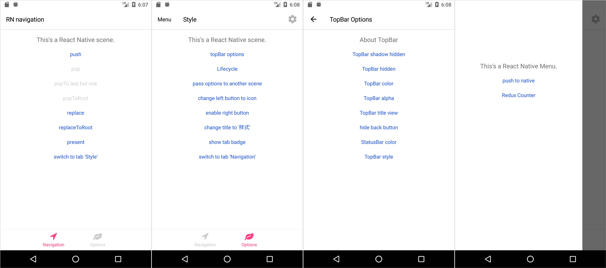

# hybrid-navigation

React Native Navigation that supports seamless navigation between Native and React.

## 特性

-   使用原生导航组件实现 React Native 页面间的导航，不仅具有更优的性能，而且使得 RN 页面具有原生质感
-   原生页面和 RN 页面共享路由， 使得它们之间相互跳转和传值轻而易举
-   内置 drawer, tabs, stack 标准容器，同时支持自定义容器和导航
-   支持 Deep Link



## 版本兼容

| 版本 | RN 版本 | RN 架构 |
| ---- | ------- | ------- |
| 2.x  | < 0.82  | 旧架构  |
| 3.x  | >= 0.83 | 新架构  |

> 当前仓库 example 使用 React Native 0.84.0，Node.js 版本需 >= 20。

## 运行 example 项目

首先 clone 本项目

```shell
git clone git@github.com:listenzz/hybrid-navigation.git
cd hybrid-navigation
```

然后在项目根目录下运行如下命令：

```shell
yarn install
yarn start
```

### 在 Android 上运行

首先，确保你有一个模拟器或设备

如果熟悉原生开发，使用 Android Studio 打开 android 目录，像运行原生应用那样运行它。

注意修改 Gradle JDK 版本为 17，否则会报错。

```error
Cause: error=2, No such file or directory
```

也可以使用命令行：

```sh
# 在项目根目录下运行
yarn android
```

你可能需要运行如下命令，才可以使用 Hot Reload 功能

```sh
adb reverse tcp:8081 tcp:8081
```

[**Download demo apk**](https://todoit.oss-cn-shanghai.aliyuncs.com/app-release.apk)

或通过扫描二维码安装 demo


### 在 iOS 上运行

首先安装 cocoapods 依赖，在项目根目录下运行如下命令：

```sh
cd ios && pod install
# 成功安装依赖后，回到根目录
cd -
```

如果熟悉原生开发，使用 Xcode 打开 ios 目录，像运行原生应用那样运行它，或者使用命令行：

```sh
# 在项目根目录下运行
yarn ios
```

## AI Agent 技能环境

本仓库已接入以下三个 Callstack 技能：

- `agent-device`：驱动 iOS/Android 模拟器或真机进行自动化交互
- `react-native-best-practices`：React Native 性能优化最佳实践
- `react-devtools`：通过 `agent-react-devtools` 读取组件树、状态和性能剖析数据

> 使用 `agent-device` 相关命令前，请确保 Node.js 版本为 `>=22`。

如需恢复技能环境（例如换机器后）：

```sh
yarn skills:restore
yarn skills:list
```

运行 React DevTools Agent 的常用命令：

```sh
# 启动 daemon
yarn devtools:start

# 查看连接状态（需要 React Native app 正在运行）
yarn devtools:status

# 停止 daemon
yarn devtools:stop
```

运行 Agent Device 的常用命令：

```sh
# 查看命令帮助
yarn device:help

# 启动 iOS / Android 目标
yarn device:boot:ios
yarn device:boot:android

# 查看安装的 App（用于拿到 bundle id / package name）
yarn device:apps:ios
yarn device:apps:android

# 抓取当前页面可交互快照
yarn device:snapshot
```

`agent-device + agent-react-devtools` 推荐联动流程：

```sh
# 1) 启动 metro 和 react devtools daemon
yarn start
yarn devtools:start

# 2) 用 agent-device 复现问题
npx agent-device open <AppNameOrBundleId> --platform ios
npx agent-device snapshot -i
npx agent-device click @eN

# 3) 用 react devtools 定位组件与渲染性能
npx agent-react-devtools profile start
# 复现同样交互
npx agent-react-devtools profile stop
npx agent-react-devtools profile slow --limit 10
npx agent-react-devtools get component @cN
```

React Native 不需要额外改代码即可连接 devtools。若使用 Android 真机，请转发端口：

```sh
adb reverse tcp:8097 tcp:8097
```

## 文档

[从这里开始](./docs/README.md)
